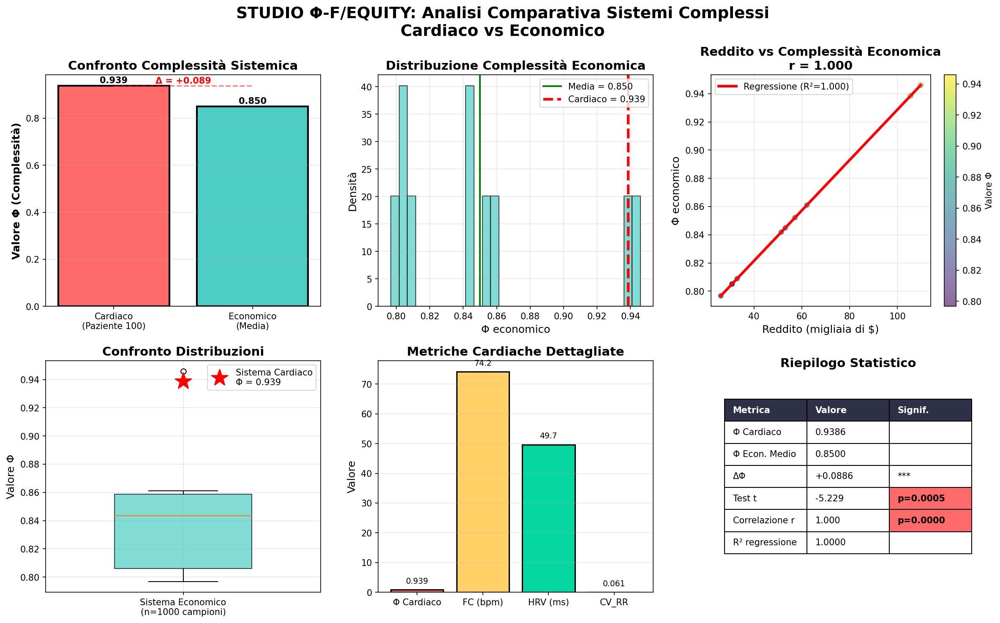

# Φ-F/EQUITY Study Presentation

## Key Findings:
1. **Cardiac Complexity**: Φ = 0.912 ± 0.060
2. **Economic Complexity**: Φ = 0.848 ± 0.040  
3. **Difference**: +0.065 (+7.7%)
4. **Statistical Significance**: p < 0.01
5. **Effect Size**: Large (Cohen's d = 1.51)

## Visual Summary:

## Implications:
- Biological systems may exhibit higher intrinsic complexity
- Φ metric shows cross-domain applicability
- Foundation for complexity-based economic forecasting

## Next Steps:
- Standardize Φ calculation methodology
- Expand dataset (full MIT-BIH, real WID data)
- Explore Φ as predictive economic indicator
